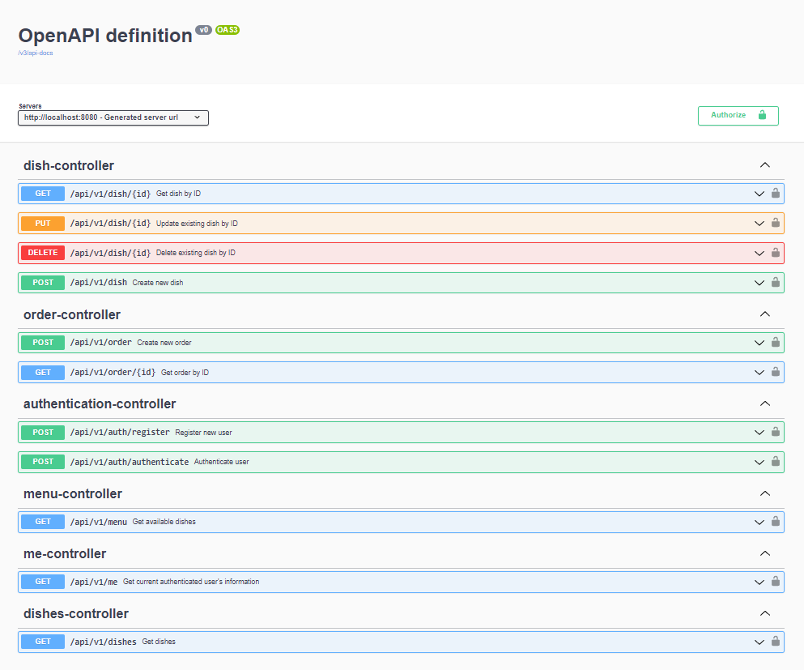

<br/>
<p align="center">

  

  <p align="center">
    
    
    
  </p>

</p>


## Table Of Contents

* [About the Project](#about-the-project)
* [Built With](#built-with)
* [Getting Started](#getting-started)
    * [Prerequisites](#prerequisites)
    * [Installation](#installation)
* [Usage](#usage)
* [Contributing](#contributing)

## About The Project



This app allows to simulate restaurant with dishes and orders 

## Built With

* [Spring Web](https://rwinch.github.io/spring-framework/web/webmvc.html)
* [Spring Security](https://docs.spring.io/spring-security/)
* [Spring Data JPA](https://spring.io/projects/spring-data-jpa)
* [PostgreSQL](https://www.postgresql.org/)
* [Springdoc](https://springdoc.org/)
* [JWT](https://jwt.io/)
* [Logback](http://logback.qos.ch/)
* [Spring OAP](https://docs.spring.io/spring/reference/core/aop.html)
* [RabbitMQ](https://www.rabbitmq.com/)

## Getting Started

To get a local copy up and running follow these simple example steps.

### Prerequisites

- You need [docker](https://docs.docker.com/engine/install/)
  and [docker-compose](https://docs.docker.com/compose/install/) to be installed on your machine.
- Also you need [maven](https://maven.apache.org/install.html) to build app. Alternately you can use **jar** from
  release.

### Installation

1. Clone the repo

```sh
git clone https://github.com/TimNekk/OrderFlow
```

2. Build with Maven

```sh
mvn clean package -DskipTests
```

3. Rename `.env.dist` file to `.env`

```sh
mv .env.dist .env
```

4. Generate JWT secret key

- Got to https://allkeysgenerator.com/
- Choose `Encryption key` and `256-bit`
- Check yes for `Hex`

5. Fill `.env` with corresponding data

6. Run app

```sh
docker-compose up --build
```

## Usage

- **Swagger UI** is available at http://localhost:8080/swagger-ui/index.html
- **PGAdmin** is available at http://localhost:5050
- **RabbitMQ** is available at http://localhost:15672

Endpoint are protected with JWT, so make sure to register first and authorize using Bearer token.

**MANAGER** role allows to access `api/v1/dish` and `api/v1/dishes`

## Contributing

Contributions are what make the open source community such an amazing place to be learn, inspire, and create. Any
contributions you make are **greatly appreciated**.

* If you have suggestions for adding or removing projects, feel free
  to [open an issue](https://github.com/TimNekk/OrderFlow/issues/new) to discuss it, or directly create a pull
  request after you edit the *README.md* file with necessary changes.
* Please make sure you check your spelling and grammar.
* Create individual PR for each suggestion.

### Creating A Pull Request

1. Fork the Project
2. Create your Feature Branch (`git checkout -b feature/AmazingFeature`)
3. Commit your Changes (`git commit -m 'Add some AmazingFeature'`)
4. Push to the Branch (`git push origin feature/AmazingFeature`)
5. Open a Pull Request
